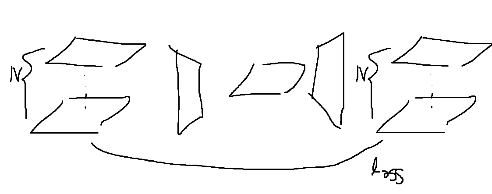

# RSNA-MICCAI-BRAIN-TUMOR-RADIOGENOMIC-CLASSIFICATION

[toc]

# Log

## 07-28

train data에 대한 분석

|  scan |      FLAIR |        T1w |      T1wCE |        T2w |
| ----: | ---------: | ---------: | ---------: | ---------: |
| count | 585.000000 | 585.000000 | 585.000000 | 585.000000 |
|  mean | 126.919658 | 132.695726 | 165.411966 | 170.940171 |
|   std | 101.291956 |  91.717739 |  81.944620 | 156.590694 |
|   min |  15.000000 |  19.000000 |  19.000000 |  19.000000 |
|   25% |  60.000000 |  32.000000 | 129.000000 |  64.000000 |
|   50% |  60.000000 | 180.000000 | 192.000000 |  64.000000 |
|   75% | 200.000000 | 192.000000 | 192.000000 | 376.000000 |
|   max | 514.000000 | 400.000000 | 400.000000 | 472.000000 |

각 `scan`별로 상이한 데이터 개수.

이 문제를 해결하기 위해서 VAE를 활용해보는 것이 어떨까 싶음 N개의 이미지를 1개의 이미지로 압축하는 encoder와 1개의 이미지를 입력 이미지 개수 N개로 추출하는 네트워크를 먼저 학습

이후 encoding된 scan별 이미지로 학습한다면 4개 채널을 갖는 이미지셋이 되어서 학습가능해 보임

하지만 우선적으로 **최대한 간단한 형태**로 이미지를 압축하여 활용해 보자. (평균과 편차 같은 측정값을 활용)